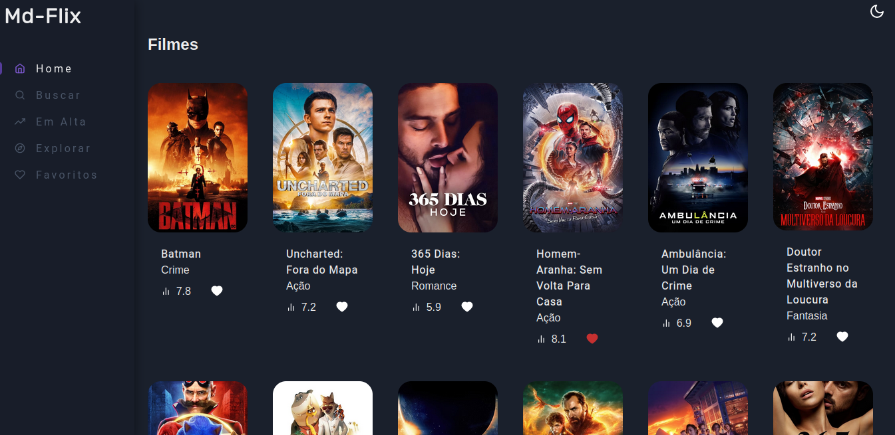
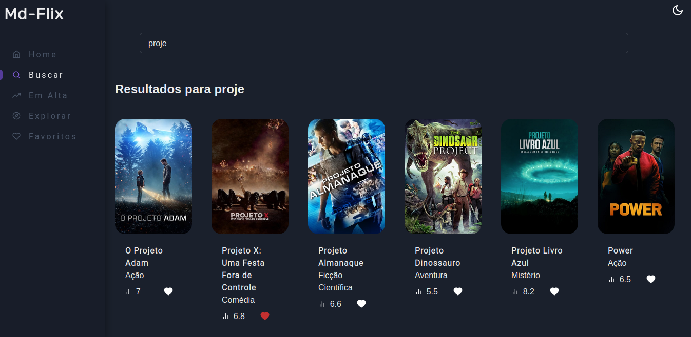

# Md-Flix

Projeto que consome a api do TMDB (themoviedatabase)

## Funcionalidades

- Ver os filmes do momento, assim como filmes com avaliações altas
- Ver sinopse dos filmes
- Pesquisar filmes filtrando por genêro
- Adicionar filmes aos favoritos para ver depois

## Imagens

<br>


<br>

## Como usar

Se você deseja acessar o projeto basta entrar no site [aqui](https://md-flix.netlify.com)

Mas se você deseja rodar o projeto em sua máquina local, Antes de tudo você precisa logar com a sua conta no site do TMDB e criar sua chave secreta da [API](https://www.themoviedb.org/settings/api)

Agora basta clonar o repositório do projeto:

```
git clone git@github.com:MoDasby/md-flix.git
```

Agora entre na pasta do projeto:

```
cd md-flix
```

Crie um arquivo chamado .env e adicione a seguinte variável nele:

```
REACT_APP_API_KEY=<<sua api key>>
```

Agora basta instalar as dependências e iniciar o app:

```
npm install
```

```
npm start
```

## Tecnologias
as tecnologias utilizadas nesse projeto foram:
- React
- Typescript
- Chakra UI
- React Router